# Robot samostabilizujący (segway) 
# Systemy mikroprocesorowe - 2019
> Szymon Kwiatkowski
> Politechnika Poznańska

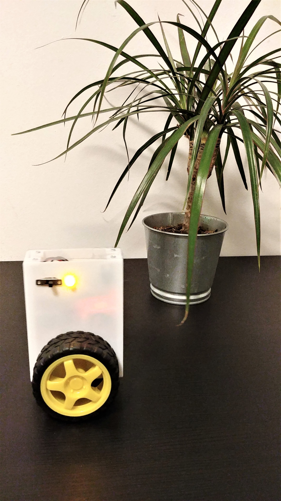

## 1. Opis projektu
Tematem projektu jest robot samostabilizujący dwukołowy. Działa on na zasadzie odwrotnego
wahadła. Utrzymuje pionową pozycję dzięki wykorzystaniu układu z akcelerometrem oraz
żyroskopem. Wspomaga go cyfrowy sterownik PID zrealizowany na mikrokontrolerze
STM32f103RC8T6. Wykorzystałem dany mikrokontroler aby poszerzyć moją wiedzę na temat
programowania mikrokontrolerów innych niż atmega.

## 2. Budowa układu
### Spis elementów elektronicznych:

- Mikrokontroler STM32f103RC8T6 (bluepill)
- Moduł MPU-
- Sterownik silnika SN75441ONE
- Silnik DC znaleziony z odzysku
- Stabilizator napięcia 5V L7805CV
- Elementy pasywne

### Schemat połączeń układu:

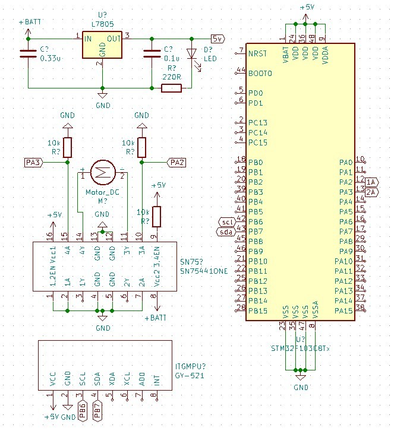

### Połączenia wykonane na płytce prototypowej:

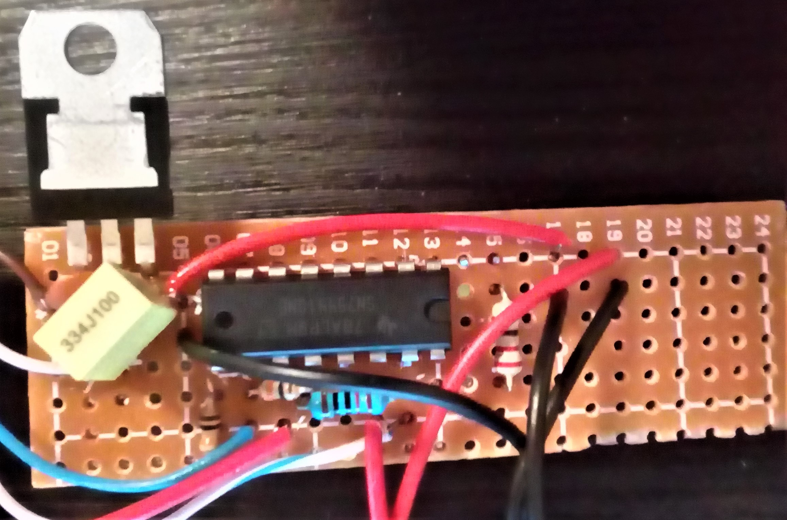

## 3. Elementy oprogramowania
### Uproszczony schemat blokowy oprogramowania:

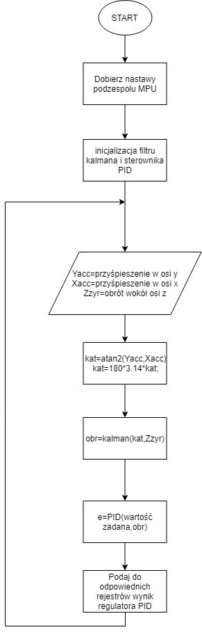

W projekcie zostały wykorzystane biblioteki z prostym regulatorem PID i filtrem Kalmana. Reszta
oprogramowania została zrobiona przy użyciu biblioteki HAL. Biblioteka z regulatorem PID jest
złożona z dwóch prostych funkcji: inicjalizacji regulatora PID, oraz obliczenie kolejnej próbki
uchybu[5]. Biblioteka z filtrem Kalmana również zawiera funkcję inicjalizującą filtr, oraz aktualizującą
odpowiedź[7]. Zostały one lekko przerobione względem oryginałów aby mogły działać w programie
pisanym w języku C.

## 4. Wykorzystane narzędzia projektowe
W projekcie zostało użyte środowisko atollictrueSTUDIO, jest to środowisko oparte na Eclipse.
Praktycznie nie ma możliwości znalezienia darmowego środowiska nie opartego na Eclipse.
Mikrokontroler nie był programowany w ArduinoIDE, ponieważ dzięki zostałem zapoznany z nowym
sprzętem i nowymi środowiskami. Do projektowania obudowy posłużył program SolidWorks, a
schematu elektrycznego środowisko KiCad. Do załadowania programu posłużył STLink v2. Jest to
dobry i wygodny w obsłudze programator do mikrokontrolerów STM. Do podglądu zmiennych w
czasie rzeczywistym został użyty program STM Studio. Pomogło to np. wyznaczyć czas oscylacji
robota.

## 5. Weryfikacja poprawności działania układu
Układ był testowany w trzech różnych obudowach. W pierwszej nie przewidziałem niskiego momentu
silnika i nie zastosowałem żadnej przekładni oraz nie optymalizowałem odległości masy od wałów.
Robot nie miał wystarczającej mocy aby z pozycji poziomej (trzymany w rękach) obrócić się do pionu.
Druga została zrobiona w celach testu silnika z zastosowanymi przekładniami. Robot miał
wystarczający moment, ale był źle zbalansowany i brakowało miejsca na podzespoły. Ostateczna
obudowa została wydrukowana tak, aby zmieściły się 2 baterie 9V – daje to dłuższy czas działania
robota i rozkłada wagę równomiernie. Układy elektroniczne zostały umieszczone od góry na lekko
dłuższych kablach aby były dobrze widoczne i dawały możliwość wymiany baterii. Układ został
przetestowany używając regulatora P, PI i PID. Najlepsze wyniki zostały osiągnięte dla regulatora PID.
Układ wracał do pionu mimo nawet mocnych zakłóceń wywołanych pchnięciem od boku.

### Projekt pierwszej obudowy:

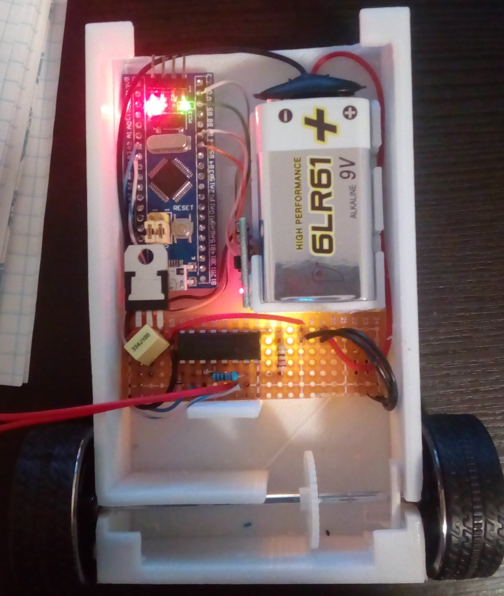

### Projekt drugiej obudowy:

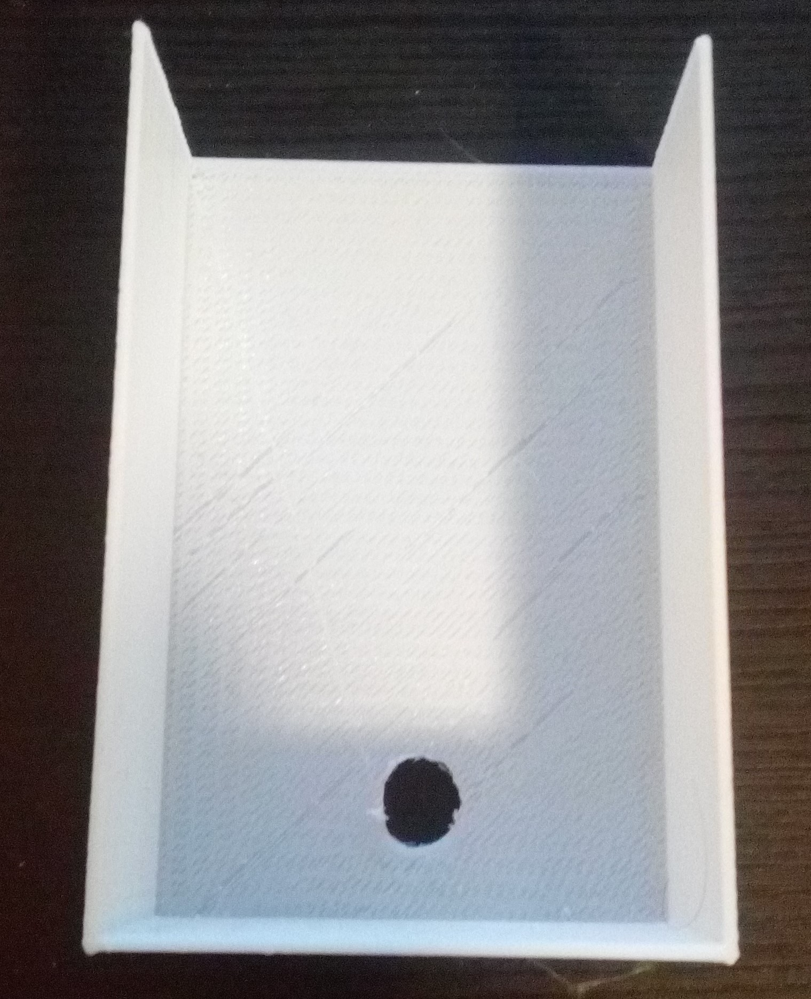

### Projekt trzeciej obudowy:

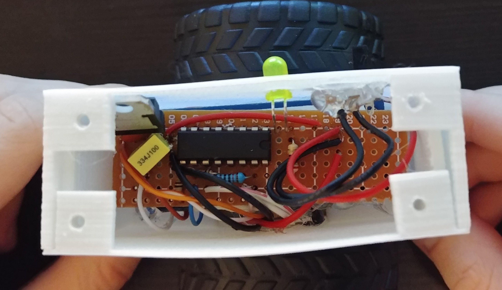

### Film z testami oprogramowania:

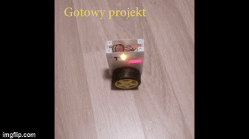

<a href="https://www.youtube.com/watch?v=QrD4yn4eAcc">
https://www.youtube.com/watch?v=QrD4yn4eAcc
</a>

## 6. Obsługa układu
Aby uruchomić układ należy przełączyć przycisk zasilania i przytrzymać robota na ziemi w pozycji
pionowej. Po około sekundzie robot sam zacznie utrzymywać równowagę. Żółta dioda świeci wraz z
załączeniem robota i informuje nas o tym, że do robota podpięte jest napięcie.

### Uruchomienie:

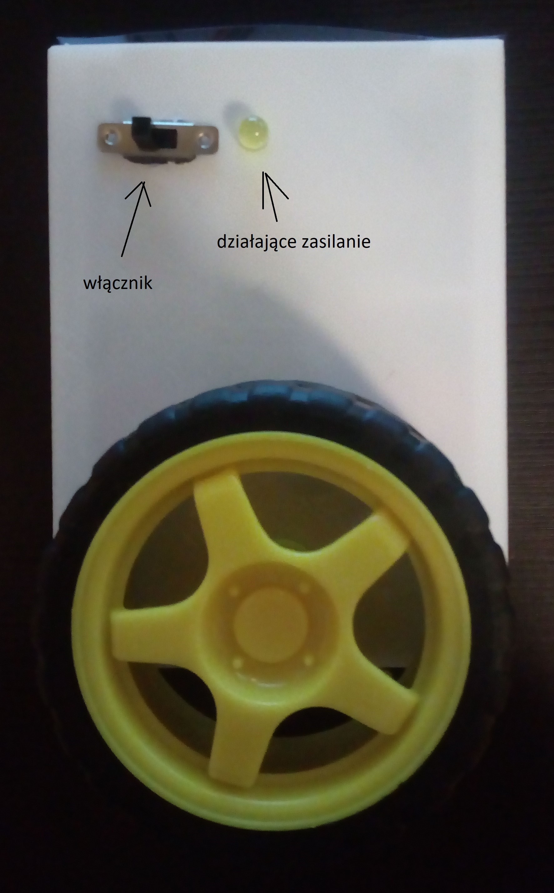

### Wymiana baterii:

1. Odkręcić śruby:

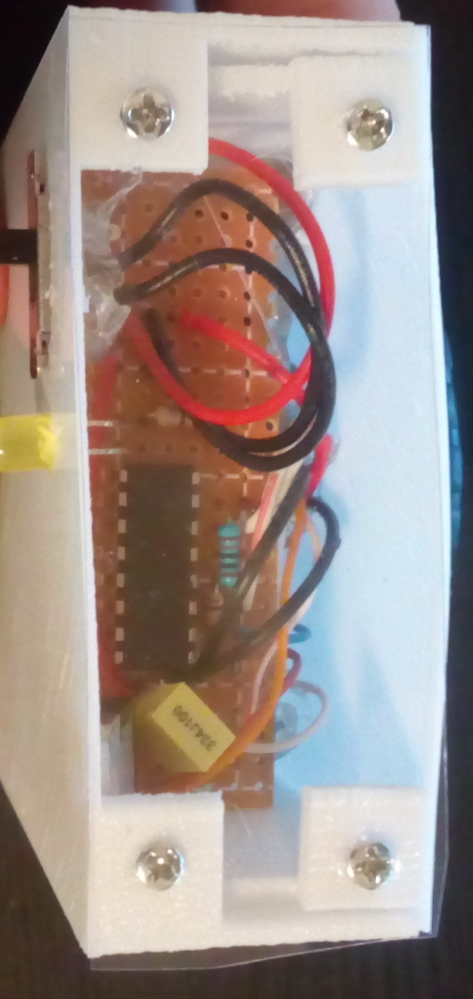

2. Zdjąć koło, następnie wysunąć pokrywę i wymienić baterie:

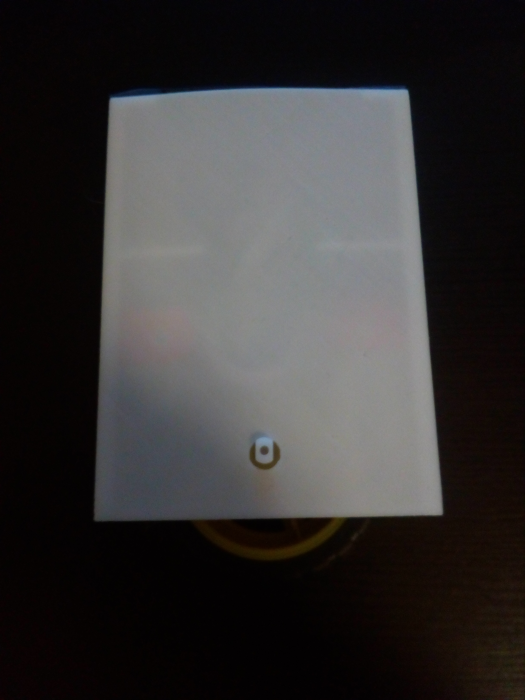

## 7. Literatura

1. [https://forbot.pl/blog/stm32-praktyce-1-platforma-srodowisko-id](https://forbot.pl/blog/stm32-praktyce-1-platforma-srodowisko-id)
2. [https://forbot.pl/blog/kurs-stm32-f1-migracja-na-hal-wstep-spis-tresci-id](https://forbot.pl/blog/kurs-stm32-f1-migracja-na-hal-wstep-spis-tresci-id)
3. [https://forbot.pl/blog/kurs-stm32-f4-1-czas-poznac-hal-spis-tresci-kursu-id](https://forbot.pl/blog/kurs-stm32-f4-1-czas-poznac-hal-spis-tresci-kursu-id)
4. [https://forbot.pl/blog/filtr-kalmana-teorii-praktyki-1-id](https://forbot.pl/blog/filtr-kalmana-teorii-praktyki-1-id)
5. [https://en.wikipedia.org/wiki/PID_controller#Pseudocode](https://en.wikipedia.org/wiki/PID_controller#Pseudocode)
6. [http://www.jarzebski.pl/arduino/rozwiazania-i-algorytmy/odczyty-pitch-roll-oraz-filtr-kalmana.html](http://www.jarzebski.pl/arduino/rozwiazania-i-algorytmy/odczyty-pitch-roll-oraz-filtr-kalmana.html)
7. [https://github.com/jarzebski/Arduino-KalmanFilter](https://github.com/jarzebski/Arduino-KalmanFilter)
8. [http://playground.arduino.cc/Main/MPU-](http://playground.arduino.cc/Main/MPU-)
9. [https://en.wikipedia.org/wiki/Ziegler%E2%80%93Nichols_method](https://en.wikipedia.org/wiki/Ziegler%E2%80%93Nichols_method)

